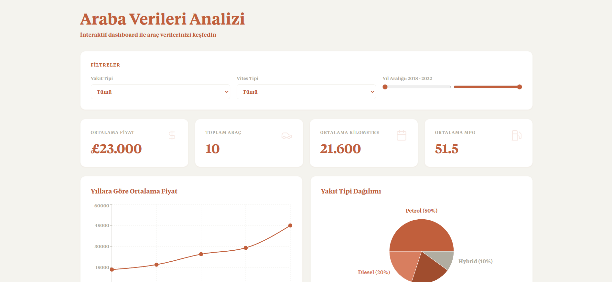
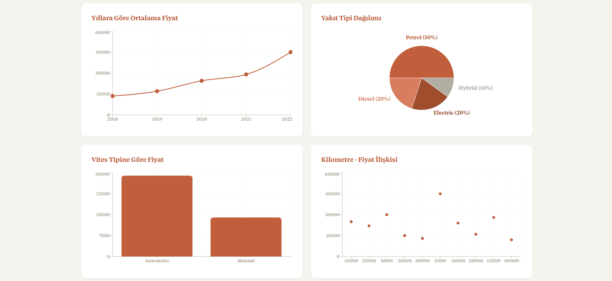

# Car Dashboard

An interactive React dashboard for exploring Ford car data. Built with Vite and Recharts, this project provides visual summaries and simple controls to filter and analyze car prices, mileage, fuel types, and more.

## Quick Start

1. Install dependencies:

   npm install

2. Start the development server:

   npm run dev

3. Open the dashboard in your browser:

   http://localhost:5173

## Notes

- The dashboard component is located at `src/CarDashboard.jsx`.
- If you want to serve a local CSV (`ford.csv`), place it in the project root or in `public/` for production builds—then use the "Load from project" button in the app.
- The project currently uses a standard serif stack (Georgia / Times New Roman) as a fallback. If you prefer to use the original font files, you can keep them in the repository or move them to `public/fonts/` and update `src/index.css` to reference `/fonts/<file>`. I will not remove the `font/` folder — you said you'll handle that yourself.

## Screenshots

-------------

## Data

Data used for this demo is available from Kaggle [Here](https://www.kaggle.com/datasets/adhurimquku/ford-car-price-prediction)

---

Data Science Portfolio: [Here](https://www.datascienceportfol.io/ahmetklncdev)
